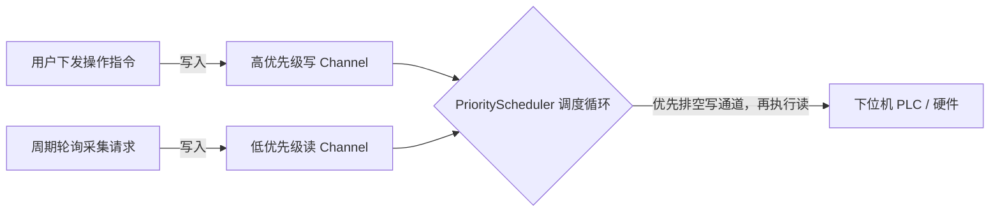

# .NET 8 上位机代码架构与多屏扩展设计方案

## 1. 架构目标与设计原则

本方案针对工业场景中复杂的下位机通信、高频实时采集、高可靠控制指令下发以及车间工控机多显示器展示需求，基于 **.NET 8 + Generic Host + WPF (MVVM)** 打造。

### 核心设计原则
1. **单一核心库（Core Library）**：所有协议抽象接口、存储抽象接口、点位与设备模型、读写双队列调度引擎、实时内存数据总线均沉淀在 `UniversalScada.Core` 核心库中，与任何具体硬件协议和具体 UI 解耦。
2. **驱动与存储插件化（DI 注入与解耦）**：通信协议（Modbus、西门子S7、三菱MC、单片机私有报文）及数据库存储（SQLite、DuckDB、TDengine、PostgreSQL）均为独立的实现类库，通过依赖注入（`IServiceCollection`）按需注册，具备极高的扩展性和替换性。
3. **独立 UI 项目与多屏扩展（Multi-Screen Architecture）**：UI 作为独立工程，只负责用户交互与视图渲染；内置屏幕管理器，支持识别现场连接的多台物理显示器，并可根据预设或动态配置将“工艺主监控”、“高频趋势曲线”、“操作控制与报警”等独立窗口精准投射到不同的物理屏幕上。

---

## 2. 解决方案工程组织（Solution Structure）

```text
UniversalSCADA.sln
│
├── 📂 src/
│   │
│   ├── 📦 1. 核心抽象与引擎 (Core)
│   │   └── UniversalScada.Core/                # 【核心库】各接口定义、数据模型与核心引擎
│   │       ├── Abstractions/                  # 接口定义 (IChannel, IDriver, IDriverFactory, IHistoryRepository)
│   │       ├── Models/                        # 核心数据模型 (TagNode, DeviceNode, ChannelConfig, TagValueSnapshot)
│   │       ├── Engine/                        # 核心引擎实现
│   │       │   ├── PriorityScheduler.cs       # 读写双队列调度器 (高优先级写插队 + 连续地址打包)
│   │       │   ├── RealtimeDataBus.cs         # 实时数据总线 (内存快照、死区计算、Rx/Channel事件广播)
│   │       │   ├── AlarmEngine.cs             # 多级报警判定引擎
│   │       │   └── HistoryArchiveWorker.cs    # 历史数据批量归档后台 Worker
│   │       └── Extensions/                    # 核心库 DI 注册扩展 (AddScadaCore)
│   │
│   ├── 📦 2. 通信协议驱动实现库 (Drivers)
│   │   ├── UniversalScada.Drivers.Modbus/     # Modbus RTU / TCP / ASCII 驱动实现
│   │   ├── UniversalScada.Drivers.Siemens/    # 西门子 S7-200/300/1200/1500 驱动实现
│   │   ├── UniversalScada.Drivers.Mitsubishi/ # 三菱 MC (Q/L/FX) 驱动实现
│   │   ├── UniversalScada.Drivers.CustomSerial/# 单片机自定义串口/TCP报文驱动 (可配置帧头帧尾校验)
│   │   └── UniversalScada.Drivers.Mqtt/       # 物联网 MQTT 遥测上报与控制驱动
│   │
│   ├── 📦 3. 数据持久化实现库 (Storage)
│   │   ├── UniversalScada.Storage.Sqlite/     # 单机轻量关系存储 (配置表 + 历史按天分表)
│   │   ├── UniversalScada.Storage.DuckDB/     # 高性能列式嵌入式时序库 (秒级处理百万采样点)
│   │   └── UniversalScada.Storage.TDengine/   # 工业级分布式时序库实现
│   │
│   └── 📦 4. 表现层与多屏管理 (UI)
│       └── UniversalScada.UI.Wpf/             # 【独立 UI 工程】基于 WPF + MVVM
│           ├── Display/                       # 多屏管理系统 (ScreenManager, 多显示器识别与窗口投射)
│           ├── Views/                         # 视图界面 (主监控、历史趋势、控制面板、报警中心)
│           ├── ViewModels/                    # 视图模型 (CommunityToolkit.Mvvm)
│           └── App.xaml.cs                    # Generic Host 宿主启动与依赖注入装配
│
└── 📂 document/                               # 系统设计文档、协议规格说明书
```

---

## 3. 核心接口与模型设计（`UniversalScada.Core`）

### 3.1 通信链路与协议抽象

```csharp
namespace UniversalScada.Core.Abstractions;

// 物理通信链路接口
public interface IChannel : IDisposable
{
    string ChannelId { get; }
    bool IsOpen { get; }
    Task<bool> OpenAsync(CancellationToken ct = default);
    Task CloseAsync();
    Task<int> SendAsync(byte[] buffer, int offset, int count, CancellationToken ct = default);
    Task<int> ReceiveAsync(byte[] buffer, int offset, int count, CancellationToken ct = default);
}

// 统一协议驱动接口
public interface IDriver : IDisposable
{
    string ProtocolName { get; }
    
    // 初始化连接
    Task<bool> ConnectAsync(IChannel channel, CancellationToken ct = default);
    Task DisconnectAsync();
    
    // 批量打包读取（由调度器计算连续地址后调用）
    Task<IReadOnlyDictionary<string, TagValueSnapshot>> ReadBatchAsync(
        IEnumerable<TagNode> tags, 
        CancellationToken ct = default);
    
    // 控制下发写操作
    Task<WriteResult> WriteTagAsync(
        TagNode tag, 
        object value, 
        CancellationToken ct = default);
}

// 驱动工厂：支持在运行时根据配置字符串自动解析驱动实例
public interface IDriverFactory
{
    IDriver CreateDriver(string protocolType);
}
```

### 3.2 历史存储仓库抽象

```csharp
namespace UniversalScada.Core.Abstractions;

public interface IHistoryRepository
{
    // 批量高速入库
    Task InsertBatchAsync(IEnumerable<TagHistoryRecord> records, CancellationToken ct = default);

    // 基于 LTTB 降采样的高性能历史查询 (用于图表秒级渲染)
    Task<IReadOnlyList<TimeSeriesPoint>> QueryDownsampledAsync(
        string tagId, 
        DateTime startTime, 
        DateTime endTime, 
        int targetPointCount, 
        CancellationToken ct = default);
}
```

---

## 4. 关键引擎设计（调度与削峰）

### 4.1 读写双优先级调度器（PriorityScheduler）
解决下位机轮询期间，用户点击“启动/急停/参数下发”被大量点位读取阻塞的问题：



- 使用 .NET 8 的 `System.Threading.Channels.Channel<T>` 构建非阻塞通道；
- 调度循环内优先尝试 `HighPriorityChannel.Reader.TryRead()`，只要有写指令，立即优先发送并等待应答；
- 连续地址合并：调度器对点位地址进行连续性检测，自动将 `40001` 到 `40020` 的点合并为单条 Modbus 03 读报文，减少 90% 的通信来回往返开销。

### 4.2 实时总线与 UI 削峰机制
- **内存快照**：核心库使用 `ConcurrentDictionary<string, TagValueSnapshot>` 保存全量实时点位数据；
- **UI 线程保护**：采集线程全速（如 10ms ~ 50ms）刷新内存快照；WPF 界面层采用 `DispatcherTimer` 以 **30 FPS (约 33ms)** 节奏定时从内存字典拉取绑定界面的可视点位，彻底避免因高频刷新导致 WPF 渲染死锁。

---

## 5. 依赖注入与装配体系（Generic Host）

所有组件均遵循标准 .NET 依赖注入规范，在 `UniversalScada.UI.Wpf` 的 `App.xaml.cs` 中实现集中装配与一键切换：

```csharp
// UI 项目的 App.xaml.cs
public partial class App : Application
{
    public static IHost AppHost { get; private set; }

    protected override async void OnStartup(StartupEventArgs e)
    {
        AppHost = Host.CreateDefaultBuilder()
            .ConfigureServices((context, services) =>
            {
                // 1. 注册核心库 (调度器、实时总线、报警引擎、后台Worker)
                services.AddScadaCore(options =>
                {
                    options.DefaultScanIntervalMs = 100;
                    options.CommandTimeoutMs = 2000;
                });

                // 2. 按需注册各协议驱动 (由具体驱动类库实现扩展方法)
                services.AddModbusDriver();
                services.AddSiemensS7Driver();
                services.AddCustomSerialDriver();

                // 3. 灵活切换持久化存储实现 (切换数据库只需改动此处注册)
                services.AddSqliteStorage("Data Source=scada_data.db");
                // 若切换到 DuckDB：services.AddDuckDbStorage("Data Source=timeseries.duckdb");
                // 若切换到 TDengine：services.AddTDengineStorage(connectionString);

                // 4. 注册多屏管理与 UI 视图模型
                services.AddSingleton<IScreenManager, WpfScreenManager>();
                services.AddSingleton<MainMonitorViewModel>();
                services.AddTransient<TrendChartViewModel>();
                services.AddTransient<ControlPanelViewModel>();
                services.AddTransient<AlarmCenterViewModel>();

                // 5. 注册窗口
                services.AddTransient<MainWindow>();
                services.AddTransient<TrendChartWindow>();
                services.AddTransient<ControlPanelWindow>();
            })
            .Build();

        await AppHost.StartAsync();

        // 启动多屏初始化投射
        var screenManager = AppHost.Services.GetRequiredService<IScreenManager>();
        screenManager.ApplyDefaultLayout();

        base.OnStartup(e);
    }
}
```

---

## 6. 独立 UI 项目的多屏管理机制（Multi-Screen Architecture）

### 6.1 物理显示器感知与管理接口

```csharp
namespace UniversalScada.UI.Wpf.Display;

public record DisplayInfo(int Index, string DeviceName, Rect Bounds, Rect WorkingArea, bool IsPrimary);

public interface IScreenManager
{
    // 获取当前接入的所有物理显示器信息
    IReadOnlyList<DisplayInfo> GetConnectedScreens();

    // 将指定窗口打开并投射绑定到指定物理屏幕
    void ShowWindowOnScreen<TWindow, TViewModel>(int screenIndex, bool isFullScreen = true)
        where TWindow : Window
        where TViewModel : class;

    // 应用多屏预设布局方案
    void ApplyDefaultLayout();
}
```

### 6.2 屏幕坐标精准定位实现（`WpfScreenManager`）

WPF 自带的 `SystemParameters` 对复杂多屏支持较弱。本方案采用 `System.Windows.Forms.Screen` 获取物理屏幕虚拟坐标，并在 WPF 中完成精确映射与 DPI 缩放适应：

```csharp
public class WpfScreenManager : IScreenManager
{
    private readonly IServiceProvider _serviceProvider;

    public WpfScreenManager(IServiceProvider serviceProvider)
    {
        _serviceProvider = serviceProvider;
    }

    public IReadOnlyList<DisplayInfo> GetConnectedScreens()
    {
        return System.Windows.Forms.Screen.AllScreens
            .Select((s, index) => new DisplayInfo(
                index,
                s.DeviceName,
                new Rect(s.Bounds.X, s.Bounds.Y, s.Bounds.Width, s.Bounds.Height),
                new Rect(s.WorkingArea.X, s.WorkingArea.Y, s.WorkingArea.Width, s.WorkingArea.Height),
                s.Primary))
            .ToList();
    }

    public void ShowWindowOnScreen<TWindow, TViewModel>(int screenIndex, bool isFullScreen = true)
        where TWindow : Window
        where TViewModel : class
    {
        var screens = System.Windows.Forms.Screen.AllScreens;
        if (screenIndex < 0 || screenIndex >= screens.Length)
        {
            screenIndex = 0; // 超出屏幕数量自动降级在主屏打开
        }

        var targetScreen = screens[screenIndex];
        var window = _serviceProvider.GetRequiredService<TWindow>();
        window.DataContext = _serviceProvider.GetRequiredService<TViewModel>();

        // 手动坐标定位
        window.WindowStartupLocation = WindowStartupLocation.Manual;
        window.Left = targetScreen.WorkingArea.Left;
        window.Top = targetScreen.WorkingArea.Top;
        window.Width = targetScreen.WorkingArea.Width;
        window.Height = targetScreen.WorkingArea.Height;

        if (isFullScreen)
        {
            window.WindowState = WindowState.Maximized;
        }

        window.Show();
    }

    public void ApplyDefaultLayout()
    {
        var screens = GetConnectedScreens();
        
        // 1号主屏始终打开工艺全景大屏
        ShowWindowOnScreen<MainWindow, MainMonitorViewModel>(0, isFullScreen: true);

        // 如果连接了2号屏幕，自动将历史趋势图投射至2号屏
        if (screens.Count >= 2)
        {
            ShowWindowOnScreen<TrendChartWindow, TrendChartViewModel>(1, isFullScreen: true);
        }

        // 如果连接了3号屏幕，将控制操作台与报警中心投射至3号屏
        if (screens.Count >= 3)
        {
            ShowWindowOnScreen<ControlPanelWindow, ControlPanelViewModel>(2, isFullScreen: true);
        }
    }
}
```

### 6.3 典型工控现场多屏职能分配

| 屏幕标号 | 对应窗口与模块 | 核心承载功能 | 交互特性 |
| :--- | :--- | :--- | :--- |
| **屏幕 1 (主监控屏)** | `MainWindow`<br>(主监控大屏) | 工艺流程拓扑图、关键指示灯、产线运行节拍、整机状态看板 | 只读监控、大幅面矢量渲染、最高优先刷新 |
| **屏幕 2 (趋势曲线屏)** | `TrendChartWindow`<br>(历史趋势分析) | 多通道高速折线图 (ScottPlot)、实时采样波形、历史数据比对 | 支持鼠标滚轮缩放、框选、百万数据点 LTTB 秒级平移 |
| **屏幕 3 (控制操作屏)** | `ControlPanelWindow`<br>(控制面板/报警) | 手动点动、设备启停、配方一键下发、实时与历史报警确认 | 具备二次确认防呆弹窗、权限角色认证 (RBAC) |

---

## 7. 关键第三方依赖与推荐组件库

- **依赖注入与宿主**：`Microsoft.Extensions.Hosting` (8.0.x)
- **MVVM 框架**：`CommunityToolkit.Mvvm` (8.x)（微软官方轻量高效、Source Generator 自动生成属性与命令）
- **通信协议库**：
  - Modbus：`NModbus` 或原生轻量封装
  - 西门子 PLC：`S7netplus` (纯 C# 实现，性能优异)
  - 三菱 PLC：原生 MC 报文解析实现
- **工业图表控件**：`ScottPlot.WPF` (5.x)（极其强悍的高性能工业绘图库，轻松流畅平移缩放数百万点数据）
- **UI 控件与样式**：`HandyControl` 或 `MaterialDesignThemes.Wpf`（现代扁平化与深色模式，符合现代上位机审美）
- **数据持久化**：`Microsoft.Data.Sqlite`、`Dapper`、`DuckDB.NET.Data.Full`
