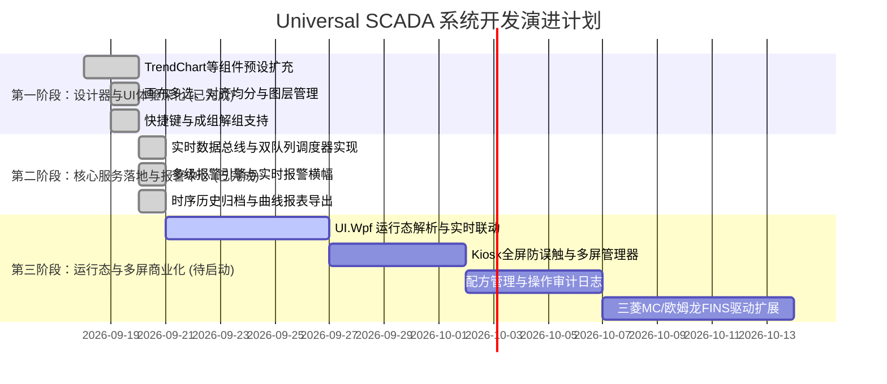

# Universal SCADA 上位机系统待开发功能规划与路线图

## 1. 概述与当前建设成果

本项目旨在构建一套高可用、可扩展、解耦的通用工业上位机系统（Universal SCADA / HMI System）。目前，系统已完成了底层的松耦合分层架构搭建以及界面设计器的核心能力：

### 1.1 当前已完成核心模块
- **通信驱动抽象与基础协议**：支持统一驱动接口 `IDriver`，已完成 Modbus（RTU / TCP / ASCII）、西门子 S7（S7-200/300/1200/1500）及单片机自定义串口报文解析驱动。
- **持久化仓储层**：基于 SQLite 实现了设备通道、点位变量配置、用户凭据、界面视图组态（`UiViewConfig`）的高效读写与持久化存储。
- **UI 设计器核心引擎**：实现了拖拽添加控件、画布缩放平移、网格辅助线、点位绑定关联、参数检查器双向数据流同步。
- **重点工控可视化组件体系**：
  - **270° 圆形仪表盘**：低中高三段分段圆弧色彩、自适应量程计算（中段绿区正对 12 点钟）、9 种行业样式预设；
  - **液体储罐**：立式/卧式横纵向自适应、纯色液体填充、自底向上增量显示、3 种行业样式预设；
  - **普通按钮**：去除卡片外框、紧凑扁平化、支持启停、急停二次防误触确认、点动复位等 6 种预设；
  - **指示灯与数显卡片**：运行/待命/故障闪烁指示灯，多种大字数显卡片预设；
  - **快捷样式切换系统**：属性面板顶层一键秒级套用，属性联动即时生效。

---

## 2. 待开发功能详细规划

根据工业现场实际应用场景与总体架构设计，后续待开发的功能模块划分为以下五大方向：

### 2.1 SCADA UI 设计器与组件层（前端可视化深化）

#### 1. 剩余工控组件专属样式预设库扩充
- **实时趋势折线图 (`TrendChart`)**：
  - 烘箱/多温区温度比对趋势图预设（带高低温预警红线）；
  - 电机工作电流/功率波动走势预设；
  - 液压系统压力脉冲监测预设。
- **设定值输入框 (`SetpointInput`)**：
  - 温度/压力设定输入框（带上下限防呆校验弹窗）；
  - 电机转速设定框（带增减步长与快速加减按钮）；
  - 虚拟数字小键盘交互（适配触控屏工业平板）。
- **DI/DO 状态点阵板 (`IoMatrix`)**：
  - 8 路 / 16 路 PLC 输入 DI 状态板预设；
  - 继电器输出 DO 板预设（带强制置位 / 复位交互与安全提示）。
- **静态与动态文本 (`TextLabel` / `DisplayBox`)**：
  - 工位铭牌、设备状态单行看板、警示跑马灯。

#### 2. 画布排版与编辑效率工具
- **多选与对齐排布**：
  - 组件多选（Ctrl+点击、橡皮筋拉框框选）；
  - 一键左对齐、右对齐、居中对齐、顶端对齐、底端对齐；
  - 一键水平等间距、垂直等间距均分分布。
- **图层层级控制**：置顶、置底、上移一层、下移一层（Z-Index 排布）。
- **成组与解组**：支持多组件成组（Group / Ungroup），方便成套工艺单元整体平移与复制。
- **常用快捷键体系**：
  - 复制（`Ctrl+C`）、粘贴（`Ctrl+V`）、删除（`Delete`）；
  - 画布撤销（`Ctrl+Z`）与重做（`Ctrl+Y`）；
  - 方向键像素级微调（按住 Shift 加速微调）。

#### 3. P&ID 工艺拓扑与管道动效
- **工业管道图元 (Pipe)**：横向与纵向介质流向动画（虚线流动 / 跑马灯流动）；
- **动态阀门与泵 (Valve / Pump)**：气动/电动阀开闭状态切换动效，离心泵运转旋转动效。

---

### 2.2 运行态大屏监控与多屏投射（`Mal.UniversalScada.UI.Wpf`）

将设计器保存的配置直接转为车间现场使用的生产运行监控大屏：

#### 1. 运行态无缝加载与数据驱动
- 动态解析 `UiViewConfig` 并在画布上精确还原各组件；
- 移除所有设计器辅助线、手柄与选中框，开启高帧率（30~60 FPS）低资源占用渲染；
- 自动绑定内存点位总线（`TagRuntimeHub`），毫秒级响应下位机数值刷新。

#### 2. 工控机 Kiosk 独占与防误触模式
- 全屏无边框置顶运行，隐藏 Windows 任务栏；
- 退出系统、切到设计器或最小化需输入管理员/工程师密码，杜绝车间操作工误关或误操作。

#### 3. 多物理显示器精准投射 (`ScreenManager`)
- 自动枚举工控机连接的多台物理显示器（Display 1、2、3）；
- 支持多窗口独立投射配置：
  - **屏幕 1（主屏）**：主工艺流程总览监控；
  - **屏幕 2（副屏）**：多通道实时/历史时序趋势曲线；
  - **屏幕 3（辅屏）**：实时报警流水横幅与操作控制面板。

---

### 2.3 核心业务引擎落地（`Mal.UniversalScada.Core` 服务层）

目前核心库中已定义接口，需编写具体生产级业务引擎实现：

#### 1. 实时数据总线 (`IRealtimeDataBus`)
- 高频并发内存点位快照池（`ConcurrentDictionary`）；
- 死区过滤机制（Deadband）：抑制微小漂移噪声，降低无谓 UI 重绘与历史入库压力；
- 工程量线性变换：支持 $Y = kX + b$ 转换及高低限越界保护；
- 点位通信质量戳（Quality Code）：识别 Good / Bad / Uncertain 状态。

#### 2. 读写双队列优先调度器 (`IPriorityScheduler`)
- 批量打包读取：自动识别并合并连续寄存器地址，将多次网络请求压缩为单次高吞吐读取；
- 写操作优先插队：操作员点击控制按钮时，写指令瞬间插至队列顶端下发，控制指令延迟 < 20ms。

#### 3. 多级报警评估引擎 (`IAlarmEngine`)
- 判定规则：高高限（HH）、高限（H）、低限（L）、低低限（LL）及数字量离散变位报警；
- 死区防抖与延时确认，避免工况在阈值边缘反复触发抖动；
- 运行态**实时报警流水横幅**展示、声光报警触发；
- 操作员报警确认（Acknowledge）与消除归档机制。

#### 4. 历史时序数据归档与分析 (`IHistoryRepository`)
- 高性能批量归档服务：按周期或变化触发批量写入；
- 支持单机 SQLite 按天自动分表，或集成 DuckDB 嵌入式列式时序引擎；
- 历史曲线自由缩放、标尺取词比对、数据报表导出（Excel / CSV）。

#### 5. 配方管理与参数下发服务 (`IRecipeService`)
- 多工步配方参数模板定义（如升温段、恒温段、气压参数）；
- 配方新建、编辑、另存、导入与导出；
- 一键批量写入下位机并执行回读比对校验，确保下发 100% 准确。

---

### 2.4 通信协议驱动层扩展（`Mal.UniversalScada.Drivers.*`）

按工业现场常用下位机类型，逐步扩充统一驱动库：
- **三菱 MC 协议驱动**：支持 Q / L / FX / iQ-R 系列 PLC（二进制与 ASCII 帧）；
- **欧姆龙 FINS 协议驱动**：支持 CP / CJ / CS / NJ 系列 PLC；
- **物联网 MQTT 驱动**：支持接入工业网关、云边协同及标准 IoT JSON 遥测报文；
- **OPC UA Client 驱动**：统一接入第三方 OPC UA Server。

---

### 2.5 用户权限管理与安全审计（Auth & Audit）

- **多级角色权限控制**：
  - 参观者：仅允许查看画面，禁止任何控制下发；
  - 操作员：允许常规启停与配方切换；
  - 工程师：允许修改参数阈值、报警限值与点位配置；
  - 管理员：拥有全系统最高权限（账号管理、系统退出、视图设计）。
- **合规操作审计日志 (Audit Log)**：
  - 严密记录所有关键动作：操作人、操作时间、变更前值、变更后值、操作来源、下发结果；
  - 审计记录不可篡改，支持审计追踪与导出。

---

## 3. 推荐实施路线图（三阶段演进计划）

### 阶段一：设计器与工控组件交互深化（✅ 已全面交付落地）
- 扩充实时趋势图（TrendChart）、管道流动、IO状态板、设备状态卡片的工业样式预设库；
- 落地设计器画布多选、一键对齐均分（左/右/顶/底/居中/横向均分/纵向均分）、图层置顶置底；
- 落地 Ctrl+C / Ctrl+V / Ctrl+A / Delete 快捷键与方向键像素级微调。

### 阶段二：核心业务引擎与报警历史中心（✅ 已全面交付落地）
- 落地 `RealtimeDataBus` 高并发内存快照池与死区过滤算法；
- 落地 `PriorityScheduler` 读写双优先级调度引擎（控制写指令优先插队响应）；
- 落地 `AlarmEngine` 多级（高高限/高限/低限/低低限/变位/坏值）判定与状态机、一键确认 ACK；
- 落地 `SqliteHistoryRepository` 高速时序批量入库与分桶降采样图表查询、`HistoryArchiveWorker` 后台双阈值归档；
- 落地 `AlarmBannerControl` 工业暗黑实时报警浮动条与呼吸警示展开抽屉；
- 全套单元测试覆盖，150 项测试 100% 通过，0 警告 0 错误。

### 阶段三：运行态全屏大屏与商业化落地（🚀 下一阶段推进目标）
- 完善 `Mal.UniversalScada.UI.Wpf` 运行态大屏渲染与真实点位数据绑定；
- 引入 `ScreenManager` 多物理显示器自动识别与独立视窗投射；
- 完善配方管理、操作审计日志与更多 PLC（三菱 MC、欧姆龙 FINS）通信驱动。
