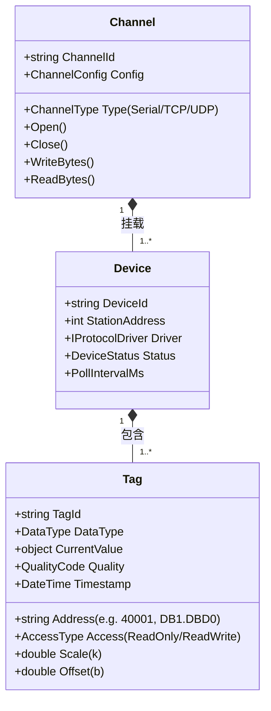
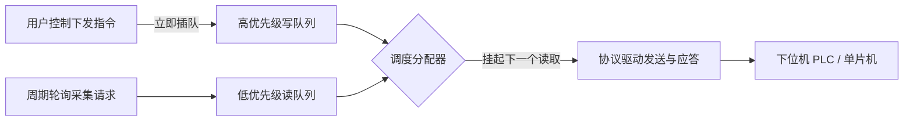

# 通用上位机管理软件架构设计方案

## 1. 方案概述

### 1.1 背景与目标
本项目旨在打造一套高可用、可扩展、解耦的通用上位机软件系统（Universal SCADA / HMI System）。系统能够统一接入工业自动化与物联网领域的多种下位机设备（如西门子/三菱/欧姆龙等主流PLC、嵌入式单片机系统、智能仪表、网关等），通过多种工控及物联网通信协议实现：
- **实时监控**：集中采集多设备状态与参数，提供低延迟的实时组态/大屏交互；
- **双向控制**：支持操作员反向下发控制指令、参数配方与启停操作，具备安全防呆与写优先机制；
- **历史归档与分析**：对海量时序采样数据进行高吞吐持久化，提供亚秒级缩放平移的高性能历史曲线与报表分析；
- **报警与审计**：提供全生命周期报警评估与通知，记录所有控制下发与参数修改的操作审计日志。

---

## 2. 总体架构分层

系统采用分层松耦合与事件驱动架构，从下至上划分为驱动通信层、实时总线层、应用服务层、数据存储层与交互展示层：

```mermaid
flowchart TB
    subgraph UI_Layer [1. 交互展示层 (UI / HMI Layer)]
        Dashboard[实时监控大屏 / 组态图]
        Charts[历史趋势与报表分析 (高性能图表)]
        AlarmView[实时/历史报警中心]
        ControlPanel[控制面板 (安全联锁/防呆/参数设定)]
        ConfigUI[点位组态 & 通信拓扑配置]
        RecipeUI[配方管理 / 批次下发]
    end

    subgraph App_Layer [2. 业务应用层 (Application Layer)]
        TagManager[点位管理中心 (Tag Engine)]
        AlarmEngine[多级报警判定与通知引擎]
        HistoryRecorder[历史数据批量归档服务]
        RecipeEngine[配方校验与下发控制]
        AuthAuditService[权限管理与操作审计 (Audit Log)]
    end

    subgraph Core_Bus [3. 实时总线与内存层 (Realtime Data Bus)]
        LiveCache[实时内存快照 (Key-Value / Concurrent Dict)]
        EventHub[发布/订阅事件总线 (In-Memory Channel / Rx)]
        DataFilter[死区过滤 / 量程变换 / 质量戳标记]
    end

    subgraph Driver_Layer [4. 通信与驱动层 (Southbound Driver Layer)]
        Scheduler[采集调度器 (周期轮询 + 优先写队列)]
        ProtocolAdapter[统一协议驱动抽象 (IProtocolDriver)]
        subgraph Drivers [具体协议驱动实现]
            Modbus[Modbus RTU / TCP / ASCII]
            S7[Siemens S7 (S7-200/300/1200/1500)]
            MC[Mitsubishi MC (FX / Q / iQ-R)]
            FINS[Omron FINS]
            OPCUA[OPC UA Client]
            MQTT[MQTT / IoT JSON]
            CustomSerial[单片机私有串口/TCP协议]
        end
        ChannelMgr[通信链路管理 (串口池 / TCP连接池 / 心跳重连)]
    end

    subgraph Storage_Layer [5. 数据持久化层 (Storage Layer)]
        TSDB[(时序/历史数据库: SQLite / DuckDB / TDengine)]
        ConfigDB[(关系型配置库: SQLite / PostgreSQL)]
    end

    UI_Layer --> App_Layer
    App_Layer --> Core_Bus
    Core_Bus <--> Driver_Layer
    App_Layer --> Storage_Layer
    Driver_Layer --> ChannelMgr
```

---

## 3. 核心模块与关键机制设计

### 3.1 通信驱动层：三层拓扑抽象模型
为了支持多源设备异构协议，系统对物理链路与数据语义进行三层解耦：



- **Channel（通信链路）**：封装物理通道（串口波特率、TCP IP/Port、超时、断线重连逻辑）；
- **Device（逻辑设备）**：通道上的物理或虚拟节点（站号、心跳包配置、通信状态健康度监控）；
- **Tag（数据点位）**：具体寄存器或变量定义，包含物理地址映射、工程量换算（$y = k \cdot x + b$）、扫描周期、死区（Deadband）阈值。

---

### 3.2 采集调度与读写优先级冲突解决
在工业现场，上位机高频轮询读取点位的同时，操作人员可能随时下发控制指令。若采用单一顺序队列，控制指令会被大量读取请求阻塞。

为此系统采用**读写双通道与写优先插队机制**：



- **数据包连续地址合并读取（Packet Packing）**：
  - 调度器扫描某设备的所有读取点位时，若地址连续或间隔小于设定的阈值，自动合并为单次“读多个寄存器”报文，将数百次通信往返合并为数次，吞吐量提升 5~10 倍。
- **写优先插队与超时重试**：
  - 下发控制命令时直插队列头部，驱动层立即暂停下一个读取动作，优先发送写请求；
  - 提供写操作回调确认（带结果通知与失败重试次数限制）。

---

### 3.3 实时数据总线与 UI 削峰机制
- **状态快照与质量戳**：
  - 内存维护当前全量点位的快照字典（`ConcurrentDictionary<string, TagValue>`）；
  - 每个点位携带三元组：`{ Value, Timestamp, Quality }`（Good, Bad, CommFail）。
- **死区过滤（Deadband Filter）**：
  - 模拟量点位配置死区（绝对值或百分比），仅当变化幅度超过死区阈值或超过最大静默时间时才触发广播。
- **UI 渲染降频解耦**：
  - 底层采集线程全速更新内存快照（可达 10ms 甚至更高）；
  - UI 线程采用定时节流拉取（如 25fps ~ 30fps 定时器触发界面批量绑定刷新），防止高频更新造成界面掉帧甚至无响应。

---

### 3.4 历史时序数据存储与高效图表引擎
- **分层存储选型**：
  - **单机轻量方案**：配置采用 SQLite；历史数据采用 **DuckDB**（极高写入/聚合分析性能的列式数据库）或按天分表的 SQLite。
  - **中大型厂级方案**：采用 **TDengine** / **TimescaleDB**。
- **LTTB (Largest-Triangle-Three-Buckets) 降采样算法**：
  - 当用户查询跨度数周甚至数月（数百万原始点）的历史趋势曲线时，后端在查询阶段使用 LTTB 算法将数据压缩为对应屏幕分辨率的 1000~2000 个关键点；
  - 保持波形波峰、波谷与趋势特征的同时，将图表渲染耗时压缩至百毫秒以内。

---

### 3.5 报警检测与配方管理
- **报警引擎**：
  - 支持多级限值（HH / H / L / LL）、离线报警、数字量变位报警、偏差报警；
  - 报警生命周期追踪：触发 $\rightarrow$ 操作员确认 $\rightarrow$ 状态恢复；
- **配方系统（Recipe）**：
  - 保存工艺参数集合（JSON 或数据库模板）；
  - 下发前执行安全校验（参数范围、设备运行状态互锁），支持一键批量写入与下位机参数回读比对。

---

## 4. 技术栈选型建议

| 维度 | 方案 A：C# / .NET 8+ WPF 或 Avalonia (推荐) | 方案 B：B/S 架构 (Go/.NET Core + Vue 3) | 方案 C：C++ / Qt 6 |
| :--- | :--- | :--- | :--- |
| **适用形态** | 工业现场 Windows 工控机、单机专机系统 | 厂区车间大屏看板、需要手机/平板跨端监控 | 极端性能要求、嵌入式工控主板 |
| **核心优势** | • 工业通信开源生态极成熟 (NModbus, S7netplus, libplctag)<br>• C# 异步多线程 (async/await, Channel) 开发极高效<br>• WPF/Avalonia 具有强大的数据绑定与工业图表 (ScottPlot) | • 跨平台免客户端安装，支持多用户远程接入<br>• 界面现代化，ECharts/Three.js 大屏效果惊艳 | • 极低内存与系统资源开销<br>• 底层硬件交互原生支持 |
| **推荐指数** | ⭐⭐⭐⭐⭐ (工控首选主流) | ⭐⭐⭐⭐ (多端与车间监控首选) | ⭐⭐⭐ |

---

## 5. 项目工程代码组织规划 (.NET 示例)

```text
UniversalSCADA/
├── src/
│   ├── Common/                          # 基础工具库、日志、加密、扩展方法
│   │   ├── Enums/                       # 数据类型、品质码、通信协议枚举
│   │   └── Models/                      # 通用实体与数据契约
│   ├── Protocol.Core/                   # 通信抽象与驱动核心接口
│   │   ├── IChannel.cs                  # 链路层接口 (串口、TCP客户端/服务端等)
│   │   ├── IDriver.cs                   # 协议驱动层接口
│   │   ├── TagDefinition.cs             # 标签点位定义实体
│   │   └── PacketHelper.cs              # 连续地址合并算法工具
│   ├── Protocol.Drivers/                # 各类具体驱动插件
│   │   ├── Modbus/                      # Modbus RTU / TCP 驱动
│   │   ├── Siemens/                     # S7 协议驱动 (S7-200/300/1200/1500)
│   │   ├── Mitsubishi/                  # 三菱 MC 协议驱动
│   │   ├── CustomSerial/                # 单片机私有协议适配器
│   │   └── Mqtt/                        # 物联网 MQTT 订阅与发布驱动
│   ├── Engine.Core/                     # 核心调度与实时数据总线
│   │   ├── ChannelManager.cs            # 通道池与自动保活重连
│   │   ├── PriorityScheduler.cs         # 读写双队列调度器
│   │   └── RealtimeDataHub.cs           # 实时快照内存库与事件总线
│   ├── Engine.Alarm/                    # 报警评估引擎
│   ├── Engine.History/                  # 历史数据写入器与 LTTB 降采样处理器
│   ├── Storage/                         # 数据库访问层 (SQLite / DuckDB / EF Core)
│   └── UI/                              # 展现层 (WPF / Avalonia)
│       ├── Views/                       # 监控画面、图表趋势、配方页面、设置弹窗
│       ├── ViewModels/                  # MVVM 视图模型与数据绑定
│       └── Controls/                    # 工业自定义控件 (仪表盘、指示灯、阀门等)
└── document/                            # 系统设计文档与协议说明
```

---

## 6. 演进与实施路线图

1. **里程碑 1：通信内核与点位抽象（Day 1 ~ 3）**
   - 实现 `IChannel`、`IDriver` 接口；
   - 完成标准 Modbus TCP/RTU 驱动，验证多设备连接、周期轮询采集与优先写队列机制。
2. **里程碑 2：实时总线与持久化引擎（Day 4 ~ 6）**
   - 搭建内存点位快照库，实现死区过滤；
   - 搭建 SQLite / DuckDB 历史数据批量入库机制与 LTTB 降采样查询。
3. **里程碑 3：UI 监控看板与高性能图表（Day 7 ~ 10）**
   - 基于 MVVM 搭建主界面框架；
   - 集成 ScottPlot 等高性能图表组件，实现实时曲线与历史追溯；
   - 实现设备操作控制面板与防呆二次确认弹窗。
4. **里程碑 4：多协议扩展与报警/配方体系（Day 11+）**
   - 接入单片机自定义报文解析器与西门子 S7 驱动；
   - 实现多级报警检测、历史报警查询、配方一键下发与回读校验。
